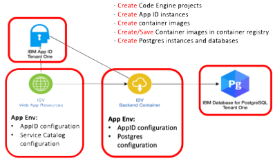
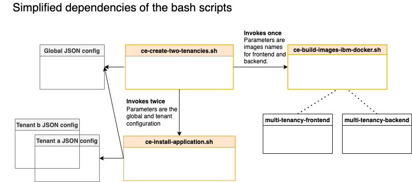

# Getting started with the example application

> Create the tenants with the related IBM Cloud services

The getting setup is **only** for the **serverless** part with **Code Engine**!

The objective is to provide you a getting started to basic understanding of the achitecture of the sample application with running instances.

The image shows simplified what we are doing during the `Getting Started`.




Here is an additional overview of tasks we automated for you with the getting started related to the diagram above.

* Create Code Engine projects

   * Configure secret to access the `IBM Cloud Container Registry`

   * Create secrets for the applications

   * Configure the environment variables used by the applications

       * App ID configurations

        * PostgresSQL database

       * Backend endpoint

* Build the container images and push them to the `IBM Cloud Container Registry`

* Create a PostgresSQL database service

    * Setup example data for each tenant

* Create an App ID service

    * Configure the service

### Prerequisites  

To follow the next steps you need to verify following two prerequisites.

* OS: `macOS` 
* Container tool: [`podman`](https://podman.io/getting-started)

> If you don't use `macOS` you maybe need to install the listed cli tools according to your operating system. Only `macOS` in combination with `podman` and the `SaaS Tools Image` was verified by us.

### `SaaS-Tools` image

For the simplification of the getting started we provide you a [SaaS-Tools container image](https://quay.io/repository/tsuedbroecker/saas-tools?tab=info) that contains all needed commandline tools for the automation with the bash scripts.

> Note: The bash automation is tailored to the bash scripting in Ubuntu, that is used as base OS for the `SaaS-Tools` image.
#### Step 1: Open a terminal and start the `SaaS-Tools` image

```sh
podman run -it --rm  --privileged --name saas-tools "quay.io/tsuedbroecker/saas-tools:v1"    
```

* Example output:

```sh
root@7f535f968abc:/# 
```

### Using the `SaaS-Tools` image

From now we will only work inside the running `SaaS-Tools` container image.

#### Step 1: Open the home directory

```sh
cd home
```

#### Step 2: Clone the repositories into the home directory

```sh
git clone https://github.com/IBM/multi-tenancy 
git clone https://github.com/IBM/multi-tenancy-backend
git clone https://github.com/IBM/multi-tenancy-frontend && cd multi-tenancy
ROOT_FOLDER=$(pwd)
```

#### Step 3: Verify the prerequisites for running the installation

```sh
cd $ROOT_FOLDER/installapp
bash ./ce-check-prerequisites.sh
```

The script stops when it notices any prerequisite is missing.

* Example output:

```sh
Check prereqisites
...
Success! All prerequisites verified!
```

These are the tools we installed for you in the `SaaS-Tools` image:

* [ibmcloud cli](https://cloud.ibm.com/docs/cli?topic=cli-install-ibmcloud-cli)
* [ibmcloud plugin code-engine](https://cloud.ibm.com/docs/codeengine?topic=codeengine-install-cli)
* [ibmcloud plugin cloud-databases](https://cloud.ibm.com/docs/databases-cli-plugin?topic=databases-cli-plugin-cdb-reference)
* [ibmcloud plugin container-registry](https://cloud.ibm.com/docs/Registry?topic=container-registry-cli-plugin-containerregcli)
* [buildah](https://buildah.io/)
* [sed](https://en.wikipedia.org/wiki/Sed)
* [kubectl](https://kubernetes.io/docs/reference/kubectl/overview/)
* [jq](https://lzone.de/cheat-sheet/jq)
* [grep](https://en.wikipedia.org/wiki/Grep)
* [libpq (psql)](https://www.postgresql.org/docs/9.5/libpq.html) 
* [cURL](https://curl.se/)
* [AWK](https://en.wikipedia.org/wiki/AWK)

### Define the needed configurations for the tenants

During the getting started we will setup two tenants of the sample application.
Therefor we need to configure two kinds of configuration files.

* Global configuration

Define the global configuration in [global.json](https://github.com/IBM/multi-tenancy/blob/main/configuration/global.json). It includes `IBM Cloud settings` such as region and resource group, `container registry information` and `image information`.

* Tenant-specific configuration

For each tenant define tenant-specific configuration in the folder 'configuration/tenants'. That configuration contains for example `App ID information`. `Postgres database information`, `application instance information`, and `Code Engine information`. Here you find an example configuration [tenant-a.json](https://github.com/IBM/multi-tenancy/blob/main/installapp/tenants-config/tenants/tenant-a.json).

#### Step 1: Configure `IBM Cloud Container Registry Namespace` in the global configuration

>The values for the names for a `IBM Cloud Container Registry Namespace` must unique in IBM Cloud for a region! To avoid problems during running the setup, please configure that name to your needs. **Don't change one of the other default values, if you do not known what you are going to change.**

1. Open the `globle.json`

```sh
nano ../configuration/global.json
```

2. Replace the value for the namespace with a value of your choose:
`"NAMESPACE":"multi-tenancy-example` to `"NAMESPACE":"YOUR_VALUE"`.

```json
{
  "IBM_CLOUD": {
    "RESOURCE_GROUP": "default",
    "REGION": "eu-de"
  },
  "REGISTRY": {
    "URL": "de.icr.io",
    "NAMESPACE": "multi-tenancy-example", #<- INSERT YOUR VALUE
    "TAG": "v2",
    "SECRET_NAME": "multi.tenancy.cr.sec"
  },
  "IMAGES": {
    "NAME_BACKEND": "multi-tenancy-service-backend",
    "NAME_FRONTEND": "multi-tenancy-service-frontend"
  }
}
```


#### Step 2: Configure  the `Code Engine project name` for each tenant

>The values for the names for a `IBM Cloud Code Engine` project must unique in IBM Cloud for a region! To avoid problems during running the setup, please configure these names to your needs. **Don't change one of the other default values, if you do not known what you are going to change.**

Configure your `Code Engine project names` for the two tenants

In the [tenant-a.json](https://github.com/IBM/multi-tenancy/blob/main/configuration/tenants/tenant-a.json) files you can to change the value for the `Code Engine project` to something like `multi-tenancy-example-mypostfix`.

1. Open the first tenant configuration `tenant-a.json`.
_(repeat these steps for the tenant-b.json file)_

```sh
nano ../configuration/tenants/tenant-a.json
```

2. Replace the value for the project name of the Code Engine project to one of your choice:
`"PROJECT_NAME":"multi-tenancy-serverless-a` to `"PROJECT_NAME":"YOUR_VALUE"`.

```json
{
  "APP_ID": {
    "SERVICE_INSTANCE": "multi-tenancy-serverless-appid-a",
    "SERVICE_KEY_NAME": "multi-tenancy-serverless-appid-key-a"
  },
  "POSTGRES": {
    "SERVICE_INSTANCE": "multi-tenancy-serverless-pg-ten-a",
    "SERVICE_KEY_NAME": "multi-tenancy-serverless-pg-ten-a-key",
    "SQL_FILE": "create-populate-tenant-a.sql"
  },
  "APPLICATION": {
    "CONTAINER_NAME_BACKEND": "multi-tenancy-service-backend-movies",
    "CONTAINER_NAME_FRONTEND": "multi-tenancy-service-frontend-movies",
    "CATEGORY": "Movies"
  },
  "CODE_ENGINE": {
    "PROJECT_NAME": "multi-tenancy-serverless-a-t" <- INSERT YOUR VALUE
  },
  "IBM_KUBERNETES_SERVICE": {
    "NAME": "niklas-heidloff3-fra04-b3c.4x16",
    "NAMESPACE": "tenant-a"
  },
  "IBM_OPENSHIFT_SERVICE": {
    "NAME": "roks-gen2-suedbro",
    "NAMESPACE": "tenant-a"
  },
  "PLATFORM": {
    "NAME": "IBM_OPENSHIFT_SERVICE"
  }
}
```

#### Optional Step 3: Using a shared `IBM Cloud Account`

>The initial design of getting started setup has the assumption that you use an own `IBM Cloud Account` and not a shared one. 

In case if you use a shared `IBM Cloud Account` with other developers you need to ensure the `AppID service` and `Postgres service` configurations are `unique` for each tenant in the shared account.

> You need to change the specifications for the used services `"APP_ID"` and `"POSTGRES"`! 

In that case you need to open up the tenants configurations again.

1. Open the first tenant configuration `tenant-a.json`.
_(repeat these steps for the tenant-b.json file)_

```sh
nano ../configuration/tenants/tenant-a.json
```

2. Replace the value for the project name of the Code Engine project to one of your choice:

* APP_ID.SERVICE_INSTANCE
* APP_ID.SERVICE_KEY_NAME
* POSTGRES.SERVICE_INSTANCE
* SERVICE_INSTANCE.SERVICE_KEY_NAME

```json
{
  "APP_ID": {
    "SERVICE_INSTANCE": "multi-tenancy-serverless-appid-a",  <- INSERT YOUR VALUE
    "SERVICE_KEY_NAME": "multi-tenancy-serverless-appid-key-a"  <- INSERT YOUR VALUE
  },
  "POSTGRES": {
    "SERVICE_INSTANCE": "multi-tenancy-serverless-pg-ten-a",  <- INSERT YOUR VALUE
    "SERVICE_KEY_NAME": "multi-tenancy-serverless-pg-ten-a-key",  <- INSERT YOUR VALUE
    "SQL_FILE": "create-populate-tenant-a.sql"
  },
  "APPLICATION": {
    "CONTAINER_NAME_BACKEND": "multi-tenancy-service-backend-movies",
    "CONTAINER_NAME_FRONTEND": "multi-tenancy-service-frontend-movies",
    "CATEGORY": "Movies"
  },
  "CODE_ENGINE": {
    "PROJECT_NAME": "multi-tenancy-serverless-a-t"
  },
  "IBM_KUBERNETES_SERVICE": {
    "NAME": "niklas-heidloff3-fra04-b3c.4x16",
    "NAMESPACE": "tenant-a"
  },
  "IBM_OPENSHIFT_SERVICE": {
    "NAME": "roks-gen2-suedbro",
    "NAMESPACE": "tenant-a"
  },
  "PLATFORM": {
    "NAME": "IBM_OPENSHIFT_SERVICE"
  }
}
```


### Start the bash script automation

#### Step 1: Open the folder for the `getting started installation`

```sh
cd $ROOT_FOLDER/installapp
```

#### Step 2: Log on with you IBM Cloud account

```sh
ibmcloud login --sso
```

#### Step 3: Start the bash automation with following command

```sh
bash ./ce-create-two-tenancies.sh
```

The execution takes roughly **30 minutes**. 

### The review steps during bash automation

You will be asked to review some configurations and press enter to move forward in some steps.
The script will stop in some situations when it discovers a problem during the setup.

These are the situations where the script asks for review your configuration.

#### a. It asks for review for the basic global configurations you made

```sh
IBMCLOUD_CR_REGION_URL: de.icr.io
IBMCLOUD_CR_NAMESPACE: multi-tenancy-example-t
RESOURCE_GROUP       : default
REGION               : eu-de
------------------------------
Verify the given entries and press return
```

#### b. After the creation and upload of the container images to IBM Cloud registry it asks for the review of your first tenant configuration

```sh
Parameter count : ../configuration/global.json ../configuration/tenants/tenant-a.json
Parameter zero 'name of the script': ./ce-install-application.sh
---------------------------------
Global configuration         : ../configuration/global.json
Tenant configuration         : ../configuration/tenants/tenant-a.json
---------------------------------
Code Engine project              : multi-tenancy-serverless-a-t
---------------------------------
App ID service instance name     : multi-tenancy-serverless-appid-a
App ID service key name          : multi-tenancy-serverless-appid-key-a
---------------------------------
Application Service Catalog name : multi-tenancy-service-backend-movies
Application Frontend name        : multi-tenancy-service-frontend-movies
Application Frontend category    : Movies
Application Service Catalog image: de.icr.io/multi-tenancy-example-t/multi-tenancy-service-backend:v2
Application Frontend image       : de.icr.io/multi-tenancy-example-t/multi-tenancy-service-frontend:v2
---------------------------------
Postgres instance name           : multi-tenancy-serverless-pg-ten-a
Postgres service key name        : multi-tenancy-serverless-pg-ten-a-key
Postgres sample data sql         : create-populate-tenant-a.sql
---------------------------------
IBM Cloud Container Registry URL : de.icr.io
---------------------------------
IBM Cloud RESOURCE_GROUP         : default
IBM Cloud REGION                 : eu-de
---------------------------------

------------------------------
Verify parameters and press return
```

#### c. After each tenant creation the URL of the frontend applications will be displayed. 

```sh
************************************
 URLs
************************************
 - oAuthServerUrl   : https://eu-de.appid.cloud.ibm.com/oauth/v4/c74c03f2-03e9-4a4a-88cf-afc82573bae7
 - discoveryEndpoint: https://eu-de.appid.cloud.ibm.com/oauth/v4/c74c03f2-03e9-4a4a-88cf-afc82573bae7/.well-known/openid-configuration
 - Frontend         : https://multi-tenancy-service-frontend-movies.l1vbi06y6y4.eu-de.codeengine.appdomain.cloud
 - ServiceCatalog   : https://multi-tenancy-service-backend-movies.l1vbi06y6y4.eu-de.codeengine.appdomain.cloud
------------------------------
Verify the given entries and press return
------------------------------
```

#### How to move on?

You can move on understand the automation or skip that part and continue with [Verify the created instances](https://ibm.github.io/multi-tenancy-documentation/serverless-via-ibm-code-engine/ce-verify-the-created-instances/).

### Details to understand the automation

Here are details related to the used bash scripts.

We use three bash scripts for the initial installation. The following diagram shows the simplified dependencies of these bash scripts used to create two tenants of the example application on IBM Cloud in Code Engine.



The scripts creating two tenants:

* Two Code Engine projects with two applications one frontend and one backend.
* Two App ID instance to provide a basic authentication and authorization for the two tenants.
* Two Postgres databases for the two tenants.

The table contains the script and the responsibility of the scripts.

| Script | Responsibility |
|---|---|
| [`ce-create-two-tenancies.sh`](https://github.com/IBM/multi-tenancy/blob/main/installapp/ce-create-two-tenancies.sh) | Build the container images for the frontend and backend, therefor it invokes the bash script [`ce-build-images-ibm-docker.sh`](https://github.com/IBM/multi-tenancy/blob/main/installapp/ce-build-images-ibm-docker.sh) and uploads the images to the IBM Cloud container registry. It also starts the creation of the tenant application instance, therefor it invokes the bash script [`ce-install-application.sh`](https://github.com/IBM/multi-tenancy/blob/main/installapp/ce-install-application.sh) twice. |
| [`ce-build-images-ibm-docker.sh`](https://github.com/IBM/multi-tenancy/blob/main/installapp/ce-build-images-ibm-docker.sh) | Creates two container images based on the given parameters for the backend and frontend image names. |
| [`ce-install-application.sh`](https://github.com/IBM/multi-tenancy/blob/main/installapp/ce-install-application.sh) | Creates and configures a `Code Engine project`. The configuration of the Code Engine project includes the `creation of the application`, the `IBM Cloud Container Registry access` therefor it also creates a `IBM Cloud API` and it creates the `secrets` for the needed parameter for the running applications. It creates an `IBM Cloud App ID instance` and configures this instance that includes the `application`, `redirects`, `login layout`, `scope`, `role` and `user`. It also creates an `IBM Cloud Postgres` database instance and creates the needed example data with tables inside the database. |

### Know issues

#### 1. net/http: TLS handshake timeout

During the creation and upload of the container image with buildah maybe you will notice like following.

```sh
Put "https://de.icr.io/v2/multi-tenancy-example-t/multi-tenancy-service-backend/blobs/uploads/25c9a689-8f60-43f3-b82f-a2fe91123ec4?_state=WMMtQe4a1npnpMoP90BkMkq0wkVPS7M1jcdYqkUqqul7Ik5hbWUiOiJtdWx0aS10ZW5hbmN5LWV4YW1wbGUtdC9tdWx0aS10ZW5hbmN5LXNlcnZpY2UtYmFja2VuZCIsIlVVSUQiOiIyNWM5YTY4OS04ZjYwLTQzZjMtYjgyZi1hMmZlOTExMjNlYzQiLCJPZmZzZXQiOjQxNzk4Njc0LCJTdGFydGVkQXQiOiIyMDIyLTAzLTAyVDE0OjExOjI1WiJ9&digest=sha256%3A8e3e6f15c16fce3aafe16ec9528311245ae74c7ce015ffaf9c796806ba02c8f8": net/http: TLS handshake timeout
```

* Solution

It this case you can just start the script execution again.

#### 2. Problem during the creation of resources

If not all resource were created properly.

* Solution

The easiest way to fix it is just to clean-up the IBM Cloud resources and restart the creation with the bash script.

Here is the link to the [Clean-Up section](https://ibm.github.io/multi-tenancy-documentation/serverless-via-ibm-code-engine/ce_clean_up/) of the documentation for the serverless part.

#### 3. Clean-Up `IBM Cloud Code Engine Project name` and `IBM Cloud Container Registry Namespace name`

> ATTENTION: The `IBM Cloud Code Engine Project Name` and the `IBM Cloud Container Registry Namespace Name` are unique inside an IBM Cloud region. 
If you delete a `Container Registry namespace` or a `Code Engine project` they can't just be recreated with the same name for a specific timeframe, they are now in a `trash` to give you a chance to restore them.

If you want to restore them with the same name you need to follow the steps in the IBM Cloud documentation:

* [IBM Cloud Container Registry - Cleaning up your namespaces](https://cloud.ibm.com/docs/Registry?topic=Registry-registry_retention)
* [IBM Cloud Code Engine `ibmcloud ce reclamation restore`](https://cloud.ibm.com/docs/codeengine?topic=codeengine-cli#cli-reclamation-restore)


>The Clean-Up scripts don't using hard deletion!


