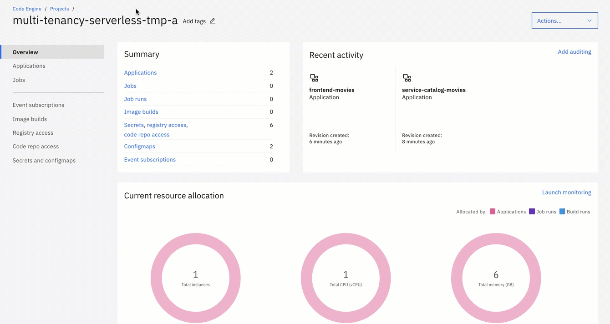

# Verify the created instances

Verify the tenants with the related IBM Cloud services instances.
### Step 1: Verify the setup by using following url [`https://cloud.ibm.com/resources`](https://cloud.ibm.com/resources)

In resource list of the IBM Cloud UI, insert as filter for **name** the value `multi`. Now you should see following in your resource list:


### Step 2: Open App ID instance for `tenant a` and inspect the configuration

Open following URL <https://cloud.ibm.com/resources>


### Step 3: Open Code Engine project for `tenant a` and inspect the project

Open following link in a browser:

```sh
https://cloud.ibm.com/codeengine/projects
```
### Step 4: Open the frontend application for `tenant a` in the Code Engine project



### Step 5: Click on URL and log on to the frontend application using **username** `thomas@example.com` and **password** `thomas4appid`

Maybe you have to log on 5 times again, in case the Code Engine has scaled to zero before.


